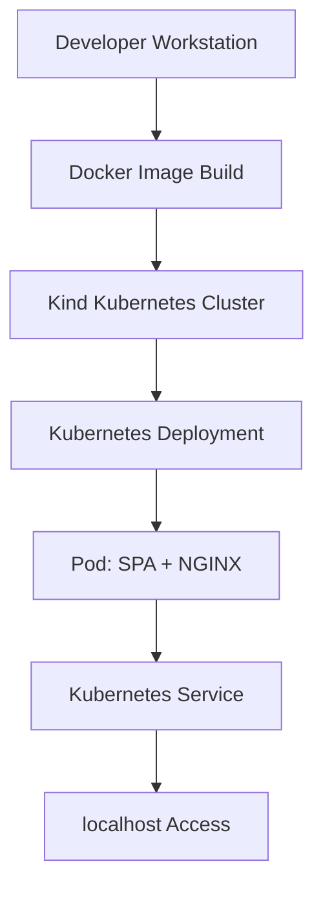

# 🚀 Full Dockerized & Kubernetes-Deployed Single Page Application

## 📖 Overview

This repository demonstrates an **end-to-end DevOps workflow** for building, containerizing, and deploying a **Single Page Application (SPA)** using **Docker**, **Kubernetes**, and **Kind (Kubernetes in Docker)** in a local development environment.

The project simulates real-world Kubernetes deployment practices and is suitable for:

- Learning Kubernetes fundamentals
- Practicing Docker-based deployments
- Showcasing DevOps skills in a portfolio

---

## 🧱 Architecture



---

## 🛠 Tech Stack

- **Frontend:** HTML / CSS / JavaScript (SPA)
- **Web Server:** NGINX
- **Containerization:** Docker
- **Orchestration:** Kubernetes
- **Local Cluster:** Kind (Kubernetes in Docker)
- **CLI Tools:** kubectl, docker, kind

---

## 📁 Project Structure

```bash
project-root/
├── spa/
│   ├── index.html
│   ├── styles.css
│   └── Dockerfile
├── deployment.yaml
├── service.yaml
└── README.md
```

---

## 🐳 Docker Configuration

### Dockerfile

```dockerfile
FROM nginx:alpine
COPY . /usr/share/nginx/html
```

### Build the Image

```bash
docker build -t spa:latest ./spa
```

---

## ☸️ Kubernetes Configuration

### Deployment

```yaml
apiVersion: apps/v1
kind: Deployment
metadata:
  name: spa-deployment
spec:
  replicas: 1
  selector:
    matchLabels:
      app: spa
  template:
    metadata:
      labels:
        app: spa
    spec:
      containers:
        - name: spa-container
          image: spa:latest
          ports:
            - containerPort: 80
```

### Service

```yaml
apiVersion: v1
kind: Service
metadata:
  name: spa-service
spec:
  type: NodePort
  selector:
    app: spa
  ports:
    - port: 80
      targetPort: 80
      nodePort: 30080
```

---

## 🚀 Deployment Workflow

```bash
docker build -t spa:latest ./spa
kind create cluster --name spa-cluster
kind load docker-image spa:latest --name spa-cluster
kubectl apply -f deployment.yaml
kubectl apply -f service.yaml
```

Access the app:

```
http://localhost:30080
```

---

## 🧪 Debugging

```bash
kubectl get pods
kubectl logs <pod-name>
kubectl describe pod <pod-name>
```

---

## 👤 Author

**D4v1d Klj4j0**  
🚀 Aspiring DevOps Engineer  
🐳 Docker | ☸️ Kubernetes | 🌐 Cloud-Native Technologies
