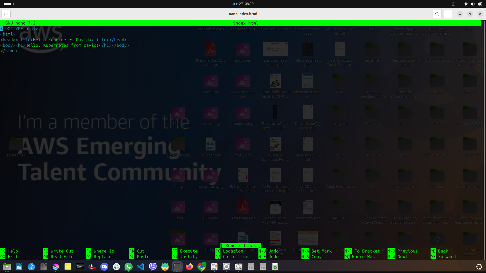
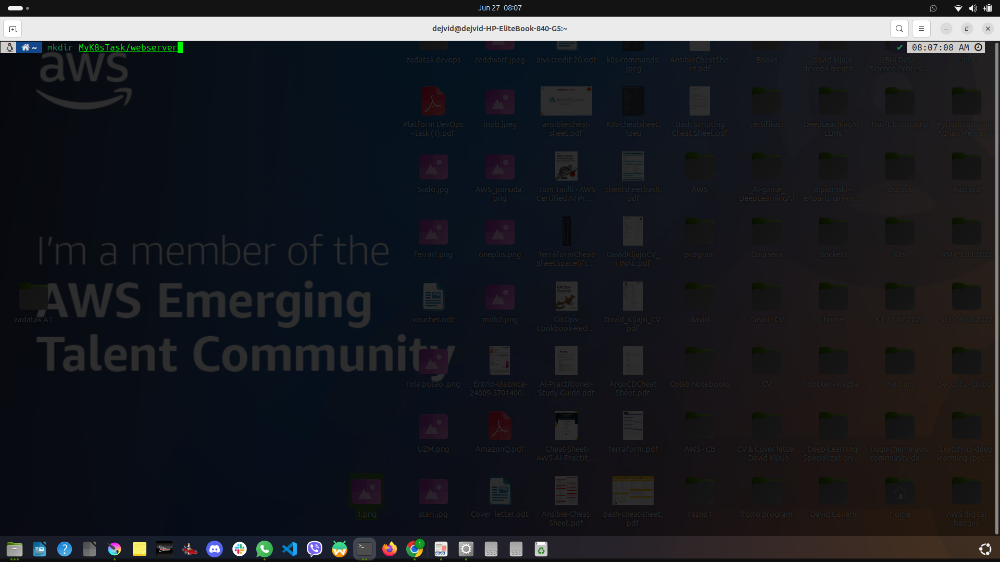
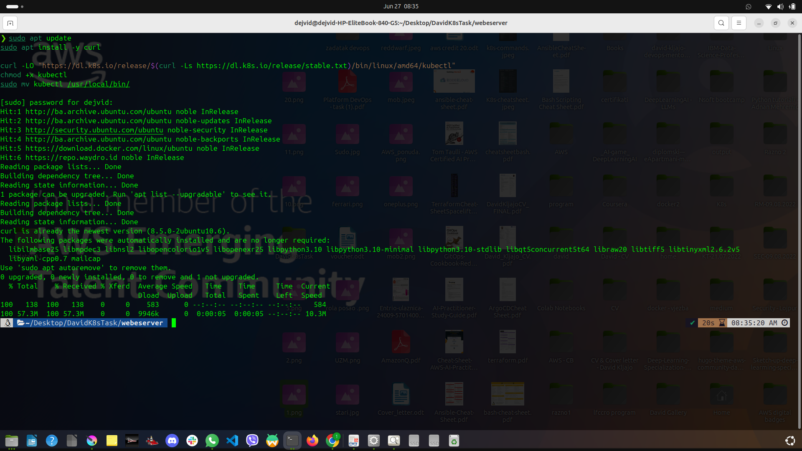

# My-First-Full-Dockerized-Kubernetes-Deployed-Web-App-

# 🚀 SPA Deployment with Docker & Kubernetes

This project demonstrates how to containerize and deploy a Single Page Application (SPA) using **Docker**, **Kind (Kubernetes in Docker)**, and **kubectl** — all running on a local environment.

 
 
 
 
 
 
 
 
 
 

---

## 🛠 Tech Stack

- HTML/CSS/JavaScript (SPA)
- Docker
- Kubernetes (via Kind)
- kubectl

---

## ⚙️ Setup Instructions

### 1. Clone the Repository

```bash
git clone https://github.com/your-username/your-repo.git
cd your-repo
