# My-First-Full-Dockerized-Kubernetes-Deployed-Web-App-

# 🚀 SPA Deployment with Docker & Kubernetes

This project demonstrates how to containerize and deploy a Single Page Application (SPA) using **Docker**, **Kind (Kubernetes in Docker)**, and **kubectl** — all running on a local environment.

1. Docker - Containerization
Docker is a platform for developing, shipping, and running applications in containers.
Containers are lightweight, portable units that contain all dependencies.
A Dockerfile is used to define instructions to build a container image.
Key commands:
- docker build -t <image-name> .
- docker run -p 8080:80 <image-name>
- docker images / docker ps / docker rm / docker rmi
2. Kubernetes
Kubernetes (K8s) is a container orchestration platform for automating deployment, scaling, and management.
Key concepts:
- Pod: the smallest deployable unit (can contain one or more containers)
- Deployment: manages Pods and ReplicaSets
- Service: abstracts access to a set of Pods
Common commands:
- kubectl get pods/services/deployments
- kubectl apply -f deployment.yaml
- kubectl port-forward svc/<service-name> 8080:80
3. Kind (Kubernetes in Docker)
Kind allows running Kubernetes clusters in Docker containers, ideal for local testing.
Commands:
- kind create cluster --name <name>
- kind delete cluster --name <name>SPA Deployment with Docker & Kubernetes
Troubleshooting:
- Docker daemon permission: use 'sudo usermod -aG docker $USER' then 'newgrp docker'
- Ensure Docker is running before creating a cluster
4. Full Deployment Steps
1. Write a Dockerfile for your SPA (e.g., using Nginx)
2. Build the image: docker build -t webserver .
3. Create deployment.yaml to define K8s resources
4. Start kind cluster: kind create cluster --name my-cluster
5. Load image: kind load docker-image webserver --name my-cluster
6. Apply deployment: kubectl apply -f deployment.yaml
7. Expose service: kubectl port-forward service/webserver-service 8080:80
5. Common Issues
- 'kubectl not found': install it from the official K8s site
- Docker permission errors: fix user group as noted earlier
- Pod stuck in Pending: check if the image is available in kind
- Context errors: ensure 'kubectl config get-contexts' shows your current context

✅ Project Overview
markdown
Copy
Edit
# 🌐 Single Page Application (SPA) in Kubernetes with Docker & Kind

This project demonstrates how to deploy a simple Single Page Application (SPA) using:

- Docker for containerizing the web app
- Kind (Kubernetes in Docker) for a local K8s cluster
- `kubectl` for managing deployments
- Nginx as a static web server

---

## 📦 Tech Stack

- HTML/CSS/JS – Frontend SPA
- Docker – Containerization
- NGINX – Serving static content
- Kubernetes – Orchestration
- Kind – Local cluster for development

---

## 🖼️ Architecture

---
📁 Project Structure
pgsql
Copy
Edit
project-root/
├── spa/
│   ├── index.html
│   ├── styles.css
│   └── Dockerfile
├── deployment.yaml
├── service.yaml
├── README.md
🧾 HTML (spa/index.html)
html
Copy
Edit
<!DOCTYPE html>
<html lang="en">
<head>
  <meta charset="UTF-8">
  <title>My SPA</title>
  <link rel="stylesheet" href="styles.css">
</head>
<body>
  <h1>Welcome to My SPA 🚀</h1>
  
This is a simple Single Page Application served using Kubernetes & Docker.

</body>
</html>
🎨 CSS (spa/styles.css)
css
Copy
Edit
body {
  background: #f2f2f2;
  font-family: 'Segoe UI', sans-serif;
  text-align: center;
  padding: 50px;
}

h1 {
  color: #2b2b2b;
}

p {
  color: #555;
}
🐳 Dockerfile (spa/Dockerfile)
Dockerfile
Copy
Edit
FROM nginx:alpine
COPY . /usr/share/nginx/html
Build the image:

bash
Copy
Edit
docker build -t spa:latest ./spa
🧠 Kubernetes Deployment (deployment.yaml)
yaml
Copy
Edit
apiVersion: apps/v1
kind: Deployment
metadata:
  name: spa-deployment
spec:
  replicas: 1
  selector:
    matchLabels:
      app: spa
  template:
    metadata:
      labels:
        app: spa
    spec:
      containers:
      - name: spa-container
        image: spa:latest
        ports:
        - containerPort: 80
🌐 Kubernetes Service (service.yaml)
yaml
Copy
Edit
apiVersion: v1
kind: Service
metadata:
  name: spa-service
spec:
  type: NodePort
  selector:
    app: spa
  ports:
    - port: 80
      targetPort: 80
      nodePort: 30080
🚀 How to Run (Step-by-Step)
bash
Copy
Edit
# 1. Build Docker Image
docker build -t spa:latest ./spa

# 2. Create Kind Cluster
kind create cluster --name spa-cluster

# 3. Load image into Kind
kind load docker-image spa:latest --name spa-cluster

# 4. Deploy to K8s
kubectl apply -f deployment.yaml
kubectl apply -f service.yaml

# 5. Access App
http://localhost:30080
📊 Diagram Summary
A SPA → Docker Image → Kind → Kubernetes (Deployment + Service) → Access via localhost:30080

🧪 Test
bash
Copy
Edit
kubectl get pods
kubectl get svc
kubectl describe pod <pod-name>
💬 Author
Dejvid
🚀 Learning DevOps | 🌐 Kubernetes | 🐳 Docker Enthusiast

  
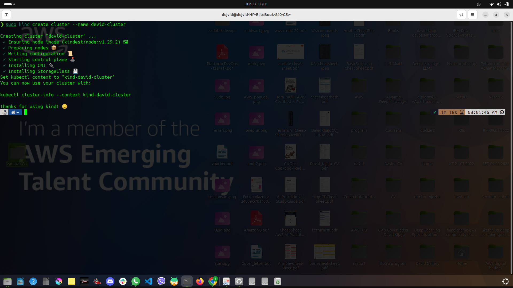 
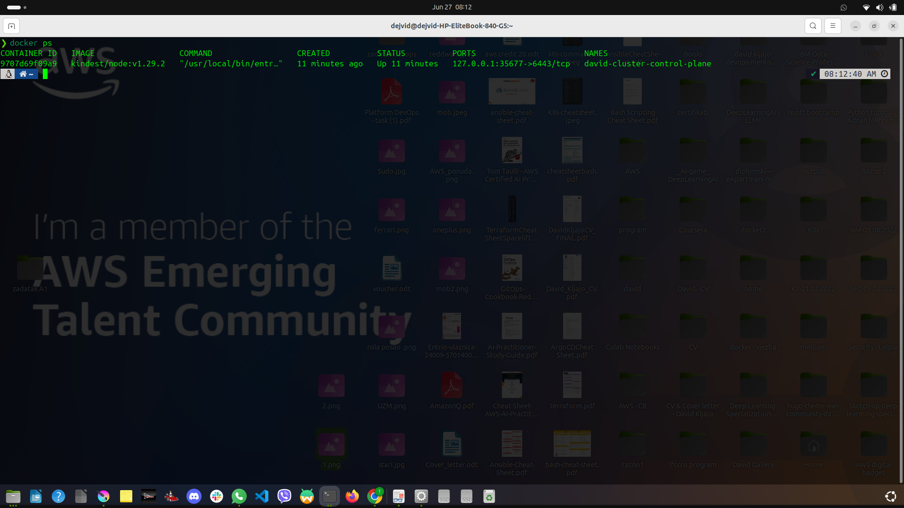 
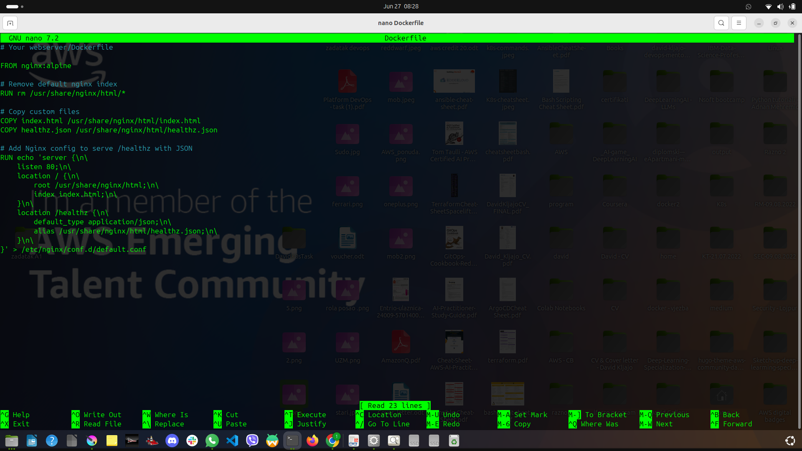 
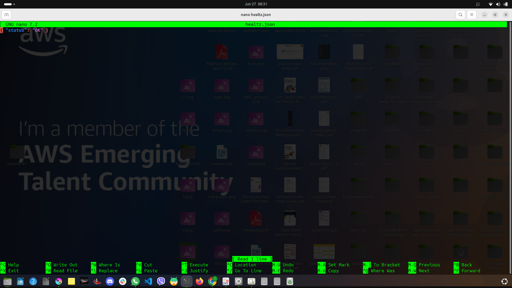 
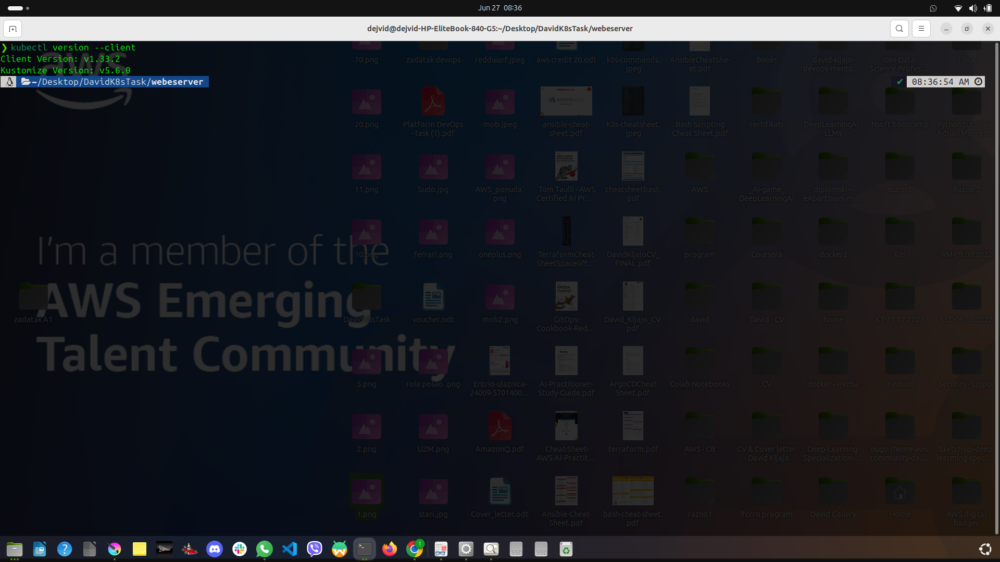 
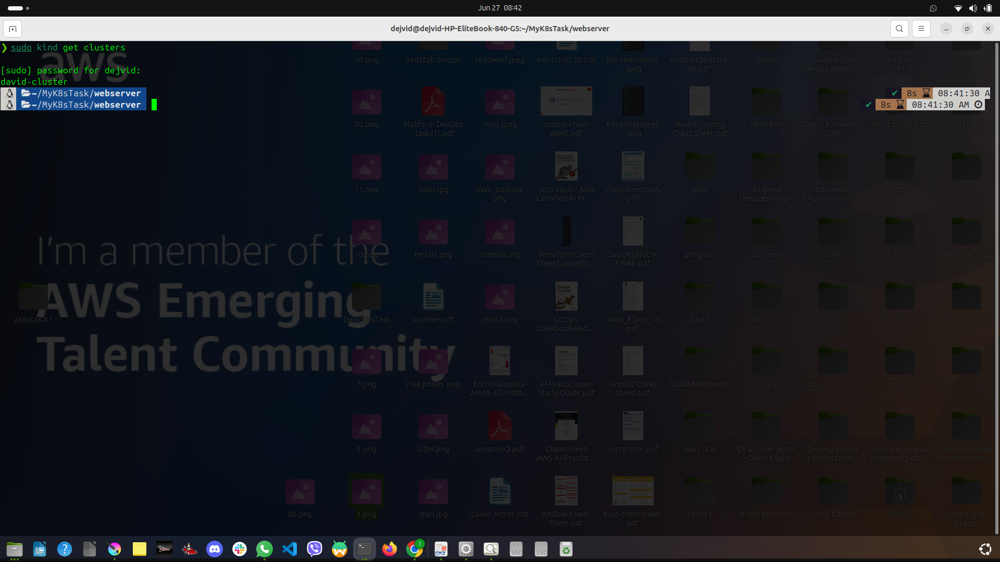 
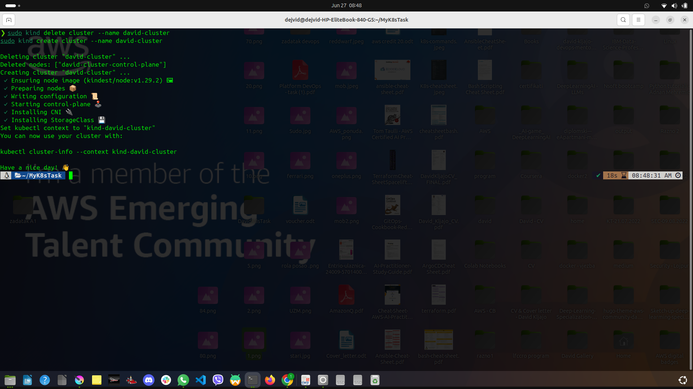 
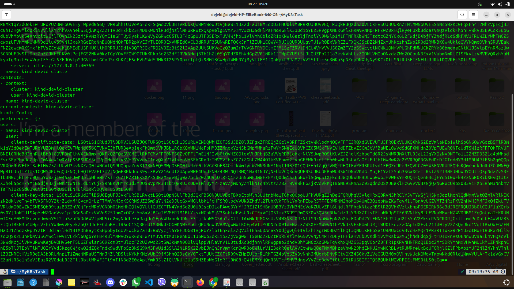 
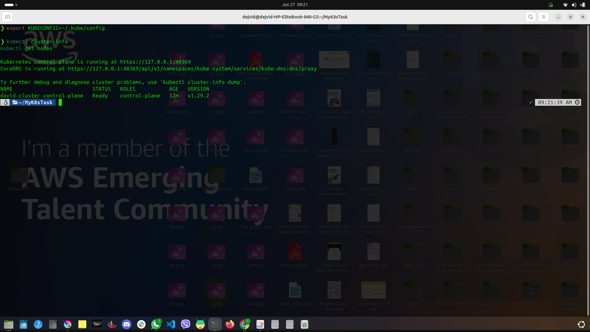
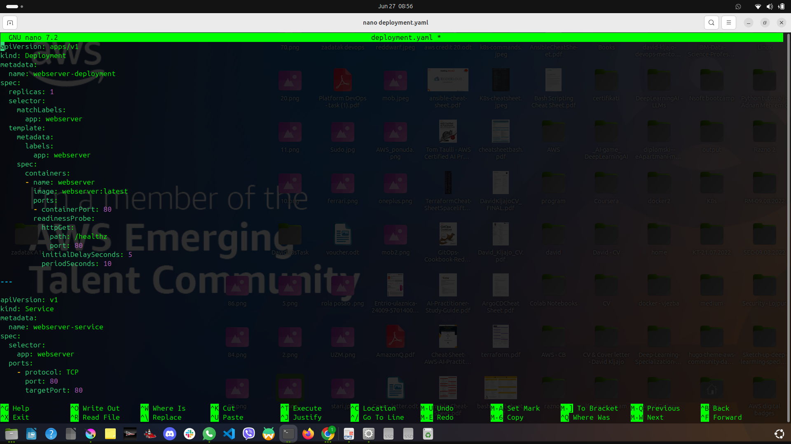
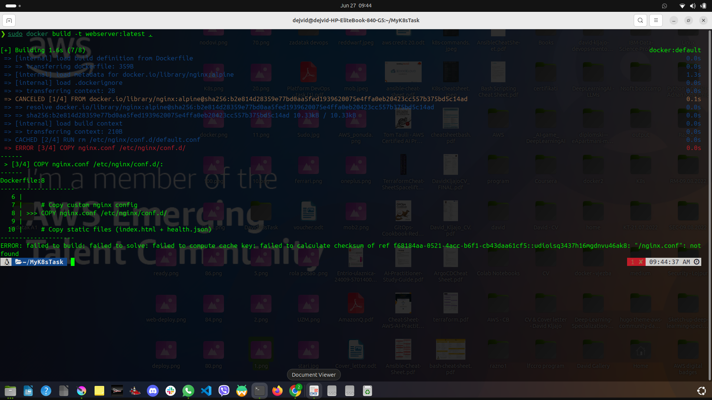
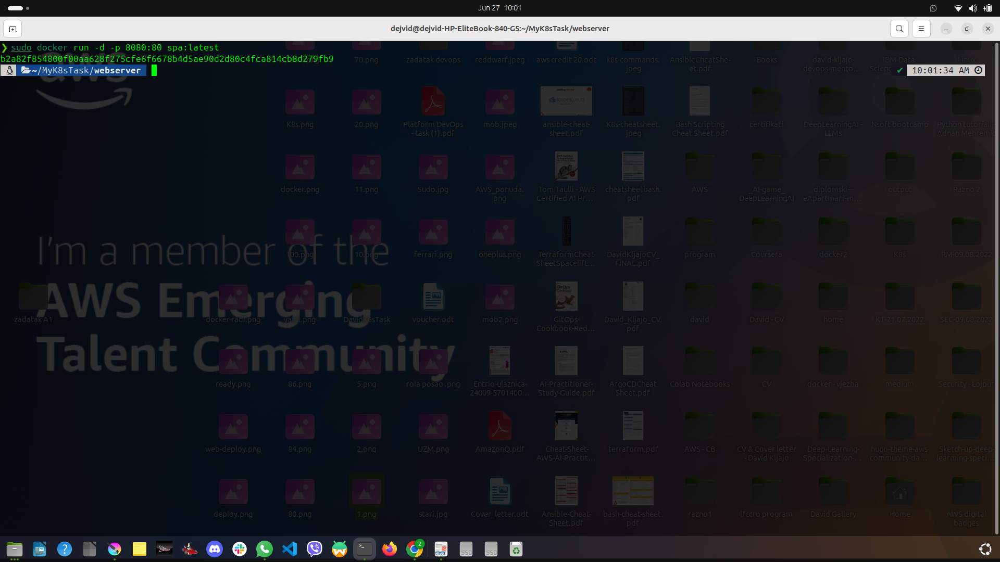
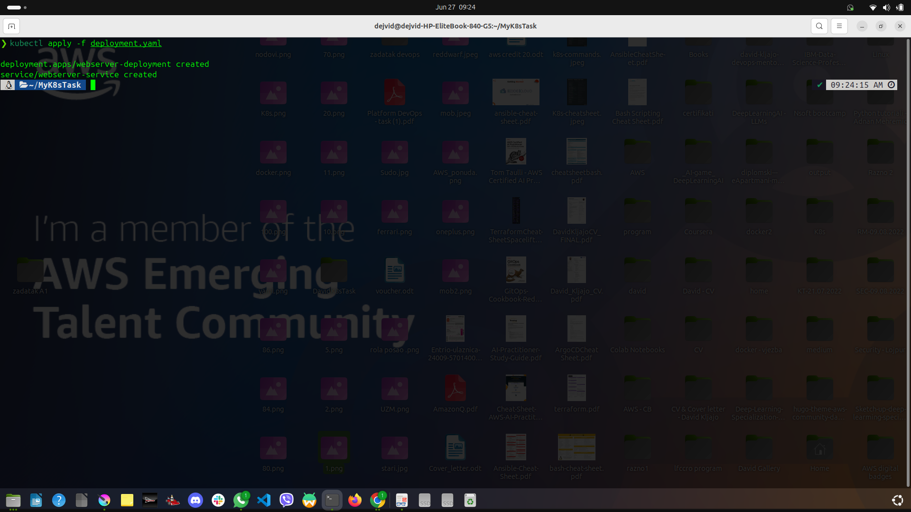
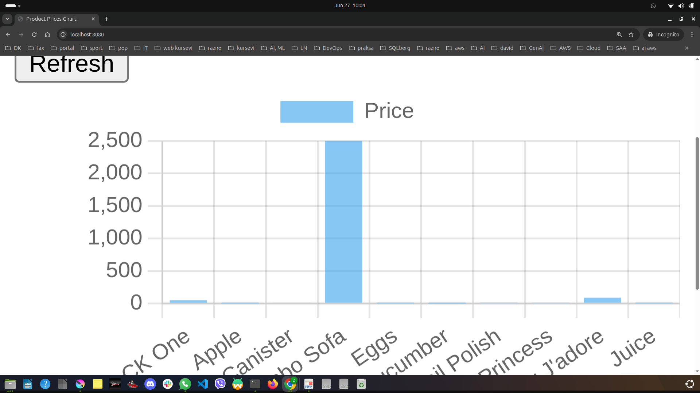

---

## 🛠 Tech Stack

- HTML/CSS/JavaScript (SPA)
- Docker
- Kubernetes (via Kind)
- kubectl

---

